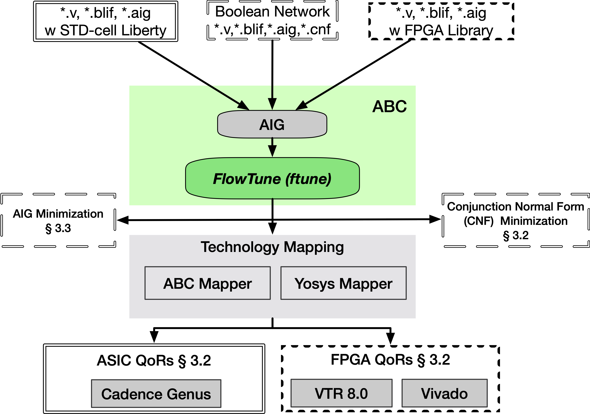
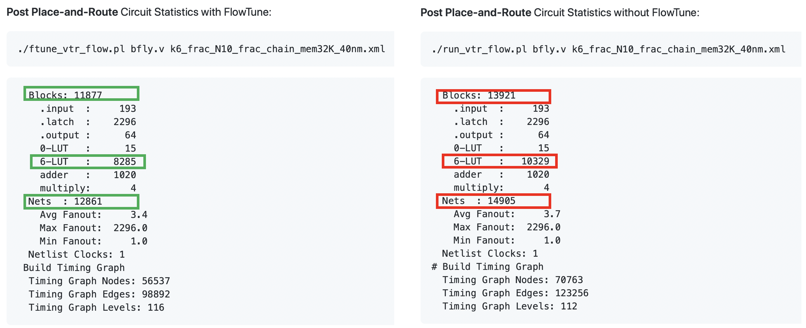

## FlowTune (Under construction more to come; source code is coming soon)

</a>

## What FlowTune does?

- Efficiently explore ABC synthesis flows (sequential decision making)

- Push-button tool/script for various QoR metrics are included

	- #AIG minimization 
	- #LUT minimization (ABC LUT mapper "if -K")
	- STD Technology mapping Delay and Area optimization
	- STA-Aware STD Technology mapping Delay optimization
	- SAT-CNF minimization (#clauses)

## What is included in this repo?

- FlowTune framework (implemented in <a href="https://github.com/berkeley-abc/abc">ABC</a>; Thanks @Alan Mishchenko)

- A set of seqeuntial FPU benchmarks in BLIF (original benchmarks from <a href="https://github.com/verilog-to-routing/vtr-verilog-to-routing">VTR 8.0</a> Thanks!@VTR Team)

- Push-button FlowTune for AIG, LUT, STD mapping optimizations (within ABC) are included.

- FlowTune push-button integration with <a href="https://github.com/verilog-to-routing/vtr-verilog-to-routing">VTR 8.0</a>. End-to-end evaluation of FlowTune till post-PnR stage is included.

- FlowTune push-button integration with <a href="https://github.com/YosysHQ/yosys">Yosys</a> (Thanks! @Yosys Team)

- FlowTune Vivado demo is included.


### Reference 
```shell
@inproceedings{yu-mab-iccad2020,
title={Practical Multi-armed Bandits in Boolean Optimization},
author={Cunxi Yu},
booktitle={2020 International Conference On Computer Aided Design (ICCAD'20)},
year={2020},
}
```

## Required Packages:
	- readline: sudo apt-get install libreadline6 libreadline6-dev (Ubuntu)
	- readline: sudo yum install readline-devel (CentOS 7)
	- -stdc++11 (tested on gcc4.9 and gcc7.0) 
	- OpenMP (https://www.openmp.org/resources/openmp-compilers-tools/ version tested 4.0.1 -- https://download.open-mpi.org/release/open-mpi/v4.0/openmpi-4.0.1.tar.gz)
		- wget https://download.open-mpi.org/release/open-mpi/v4.0/openmpi-4.0.1.tar.gz; tar -xvf openmpi-4.0.1.tar.gz
		- cd openmpi-4.0.1; ./configure; make -j12 all install
	- Yosys -- https://github.com/YosysHQ/yosys
	- export "abc" and "yosys" PATH TO .bashrc to have a global access
		- Instruction:  echo "export PATH=$(pwd):\${PATH}" >> ~/.bashrc; source ~/.bashrc
		- Testing : If PATH added succesfully, you should be able to type "abc" and "yosys" at any location of your LINUX system 
	- VTR 8.0 -- https://github.com/verilog-to-routing/vtr-verilog-to-routing

## Installation Demo on Ubuntu 20.x.x
[Installation bash script](install.sh)
#### This is an installation script (tested) for Ubuntu system to setup FlowTune+VTR8.0

```bash
# NOTE: This is an installation script (tested) for Ubuntu system
# git clone https://github.com/Yu-Utah/FlowTune;

# NOTE: Let's first install the required packages
# 	You can skip these if you have the packages in your machine, or use different methods to install these packages (e.g., if you use RedHat/CentOS, you will need to use "yum")

# sudo apt-get install libreadline-dev g++ make flex bison libgtk-3-dev;
# wget https://download.open-mpi.org/release/open-mpi/v4.0/openmpi-4.0.1.tar.gz; tar -xvf openmpi-4.0.1.tar.gz
# cd openmpi-4.0.1; ./configure; make -j12 all install;
# you can skip this OpenMP installation if you have OpenMP library
# you can check whether you have OpenMP or the version using "echo |cpp -fopenmp -dM |grep -i open"
# Ubuntu 20.x.x includes OpenMP automatically


if ! [ -x "$(command -v cmake3)" ] && ! [ -x "$(command -v cmake)" ];
then
    echo "cmake and cmake3 could not be found"
    exit
fi

# NOTE: Let's compile FlowTune with ABC
cd src/; mkdir build; cd build; cmake3 ..;
abc_dir_path="my \$abc_dir_path = \"$(pwd)\"" 
#make -j12; export PATH=$PATH:$(pwd)

# NOTE: A quick test see if FlowTune has been installed correctly
cd ../../FlowTune-AIG-Optimization/
./single_design.sh adder2 adder2.blif 1 1 0 1 1

# NOTE: Now let's setup FlowTune + VTR 8.0
cd ../; pwd
git clone https://github.com/verilog-to-routing/vtr-verilog-to-routing;
cd vtr-verilog-to-routing; #make -j12;
cd vtr_flow;
vtr_flow_pth="my \$vtr_flow_path = \"$(pwd)\""
cd scripts/perl_libs/XML-TreePP-0.41/lib;
vtr_flow_xml_lib_path="$(pwd)"
cd ../../../../;
# follow VTR installation instruction to install other packages if you cannot compile VTR
echo $vtr_flow_pth # check your vtr flow path
echo $abc_dir_path # check your flowtune-abc path

cd ../../FlowTune-VTR-Flow;ls ftune_vtr_flow.pl
echo "IMPORTANT !! - You need to change ftune_vtr_flow.pl from line 56 - 60 accordingly"
echo "1) change the use lib path using <$vtr_flow_xml_lib_path>"
echo "2) change the vtr_flow_path using <$vtr_flow_pth>"
echo "3) change abc_dir_path using <$abc_dir_path>"

# NOTE: Setup the ftune_vtr_flow.pl
# IMPORTANT !! - You need to change ftune_vtr_flow.pl from line 56 - 60 according to your VTR installation
# 1) change the use lib path using "$vtr_flow_xml_lib_path"
# 2) change the vtr_flow_path using "$vtr_flow_pth"
# 3) change abc_dir_path using "$abc_dir_path"

# To run FlowTune with VTR, just run "./ftune_vtr_flow.pl <circuit_file> <architecture_file>"
```

## FlowTune implementation in ABC

	abc 01> ftune -h
	usage: ftune [drtfpihSL]
		flowtune(ftune): Multi-Armed Bandit (MAB) synthesis flow tuning for Logic Minimization
	-t    : Targeted metric (default = 0, i.e., AIG Minization targeting number of AIG nodes)
	      : t=0 AIG Minization - Minimizing AIG nodes                       :  ftune -d i10.aig -r 4 -t 0 -p 1 -i 10 -s 5 -L [other options]
	      : t=1 AIG Minization - minimizing AIG levels                      :  ftune -d i10.aig -r 4 -t 1 -p 1 -i 10 -s 5 -L [other options]
	      : t=2 Technology mapping (w Gate Sizing + STA) Min STA-Delay      :  ftune -d i10.aig -r 4 -t 2 -p 1 -i 10 -s 5 -L your.lib(Liberty) [other options]
	      : t=3 Technology mapping (w Gate Sizing + STA) Min Area           :  ftune -d i10.aig -r 4 -t 3 -p 1 -i 10 -s 5 -L your.lib(Liberty) [other options]
	      : t=4 FPGA Mapping - Miniziming Number of 6-input LUTs            :  ftune -d i10.aig -r 4 -t 4 -p 1 -i 10 -s 5 [other options]
	      : t=5 FPGA Mapping - Miniziming Levels of 6-input LUT network     :  ftune -d i10.aig -r 4 -t 5 -p 1 -i 10 -s 5 [other options]
	      : t=6 SAT (CNF) Minization - Miniziming Number of Clauses         :  ftune -d cnf.aig -r 4 -t 6 -p 1 -i 10 -s 5 [other options]
	      : t=7 SAT (CNF) Minization - Miniziming Number of literals        :  ftune -d cnf.aig -r 4 -t 7 -p 1 -i 10 -s 5 [other options]
	      : t=8 Regular Technology mapping using GENLIB (map) Min Delay     :  ftune -d i10.aig -r 4 -t 8 -p 1 -i 10 -s 5 -L your.genlib(GENLIB) [other options]
	      : t=9 Regular Technology mapping using GENLIB (map) Min Area      :  ftune -d i10.aig -r 4 -t 9 -p 1 -i 10 -s 5 -L your.genlib(GENLIB) [other options]
	-h    : Print the command usage
	-r    : Number of appearances of each synthesis command (default = 3)
	-p    : Factor of number of Arms (default = 1)
	-i    : Number of MAB iterations (default = 10)
	-s    : Number of MAB sampling for each iteration per Arm (default = 5)
	-f    : Toggle using long-short-term memory for probability matching (default=FALSE)
	-C    : Customize the logic transformations (commands) for tuning instead of default commands. 
		 Example 1:  -C b;rw;rwz;rf (your flow will use these 4 opts).
 			
		 Example 2: -C b;rw;rwz;rf;your_cmd (You can define your new command in abc.rc namely your_cmd and tunes for these 4 opts + your_cmd).
	-S    : Toggle using Softmax() or LogSoftmax() for finalizing samples at each iteration (default=FALSE)
		    -S 0 : Using winning rate Pr
		    -S 1 : Using Softmax()
		    -S 2 : Using LogSoftmax()
	-L    : Liberty or GENLIB file. Required for Technology mapping tuning (t=2,3,8,9) 
	
## FlowTune Demos

### (a) -- AIG Node Minimization 
	Design: bfly.v
	Baseline: resyn (default abc flow) applied 25 times
	Result: FlowTune provides 20%+ more AIG reduction compared to resyn*25 
	(see video below)
	
#### Baseline 

</a>

#### FlowTune (20% more AIG reductions compared to 25+ resyn)

</a>

### (b) -- VTR (vtr-verilog-to-routing) Integration

See <b><i>./FlowTune-Integration-VTR/ftune_vtr_flow.pl</i></b> for details

#### Comparisons between default VTR vs FTune VTR 
	Design: bfly.v
	FPGA Architecture = k6_frac_N10_frac_chain_mem32K_40nm
	Result: 15% area/block reductions at Post-PnR stage, with 13% #Nets reductions.

</a>


### (c) -- More can be found in the listed folders in this repo.


